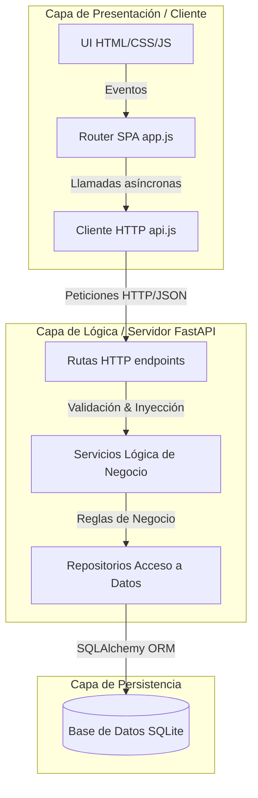
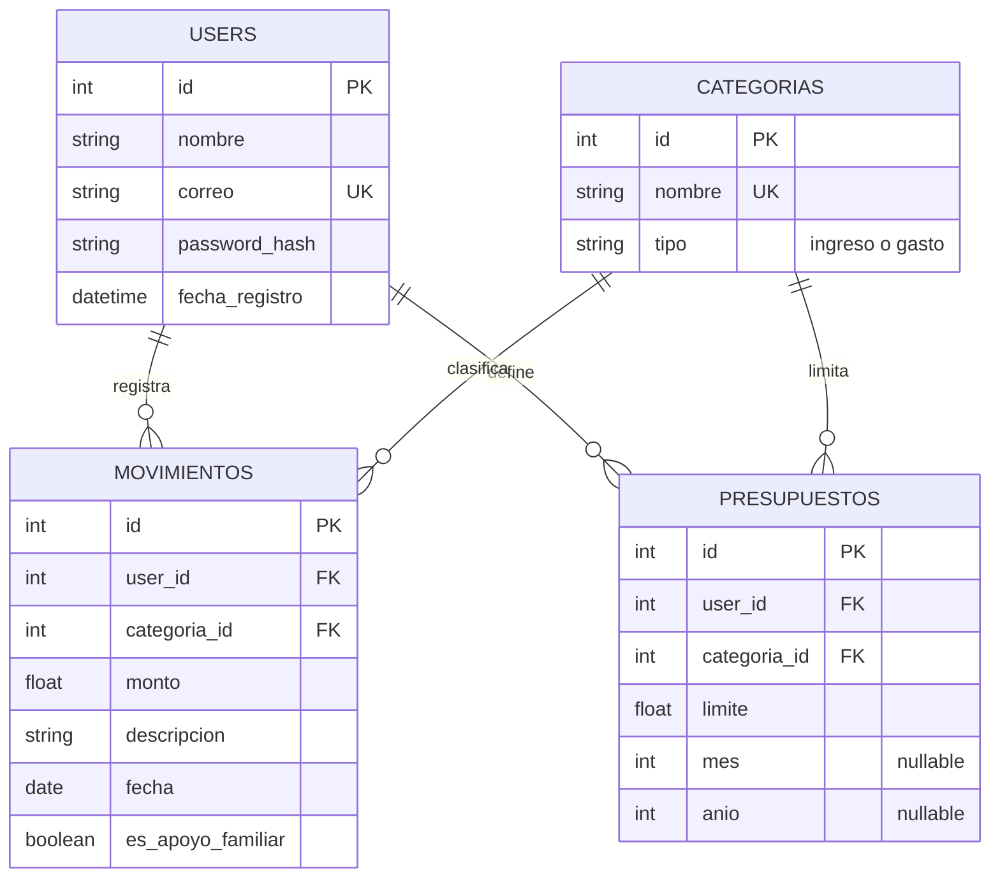
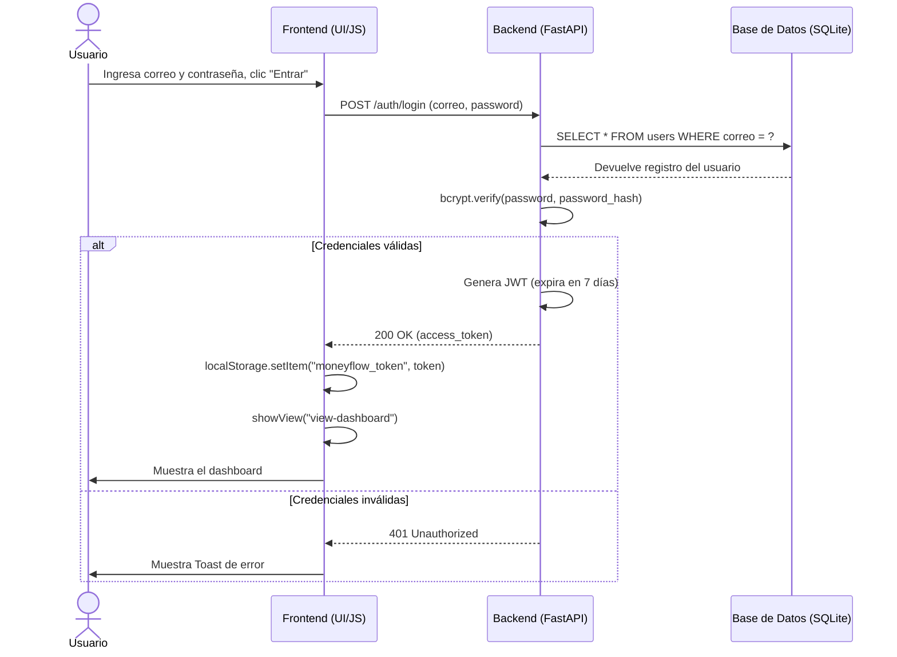
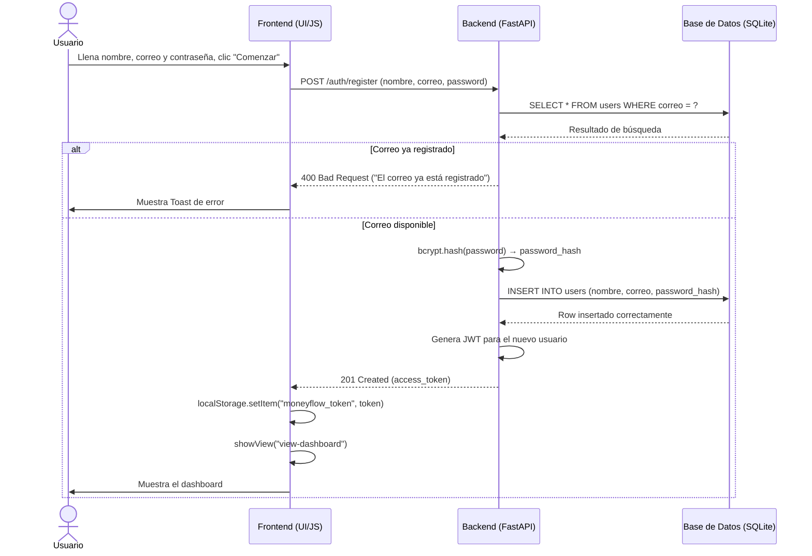
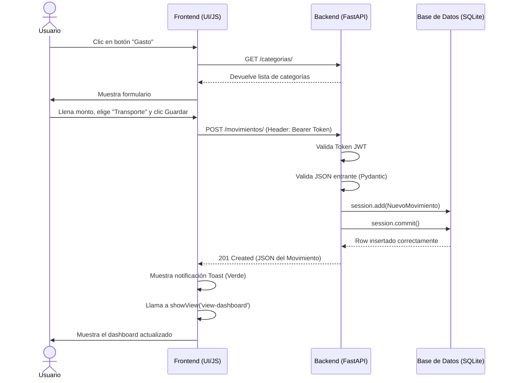
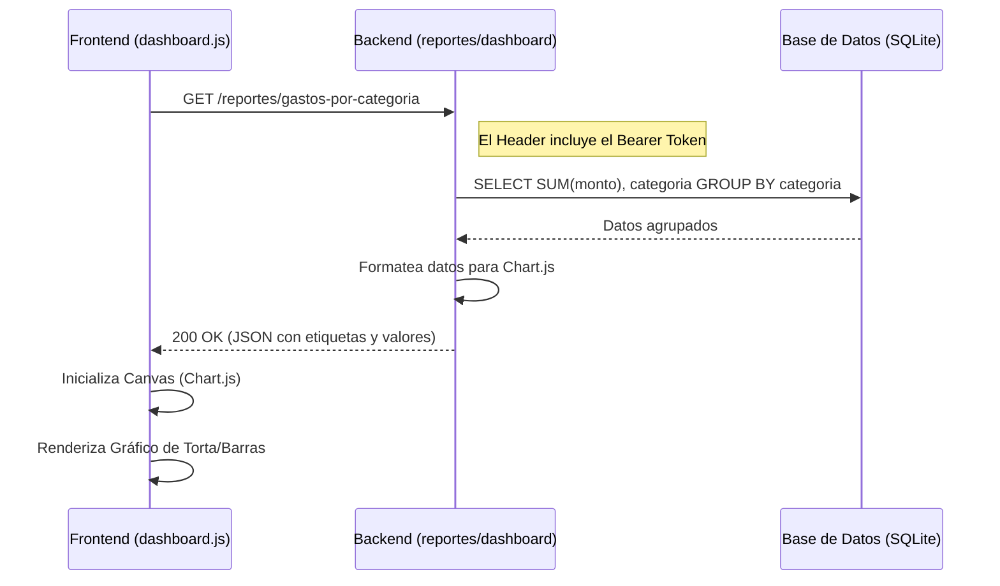
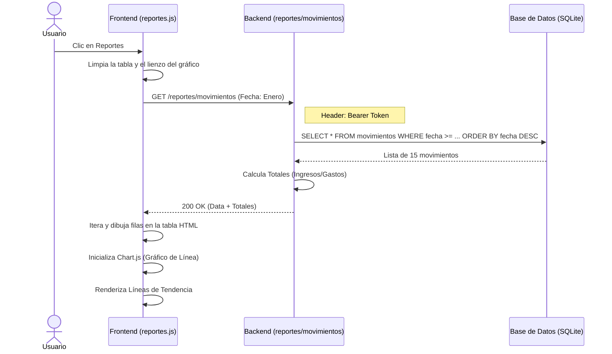
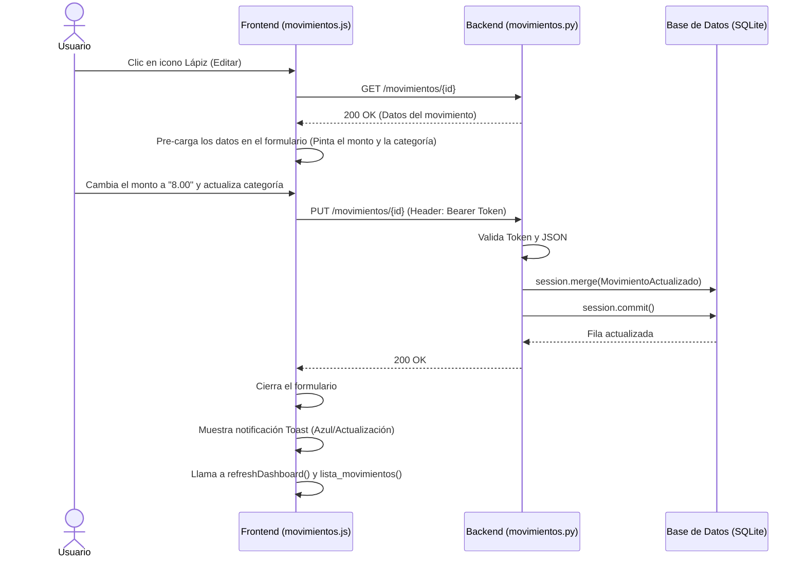
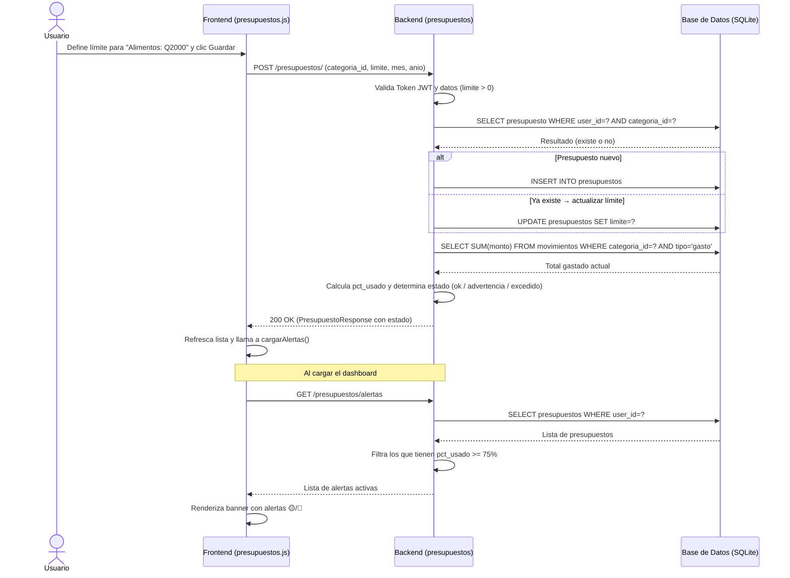
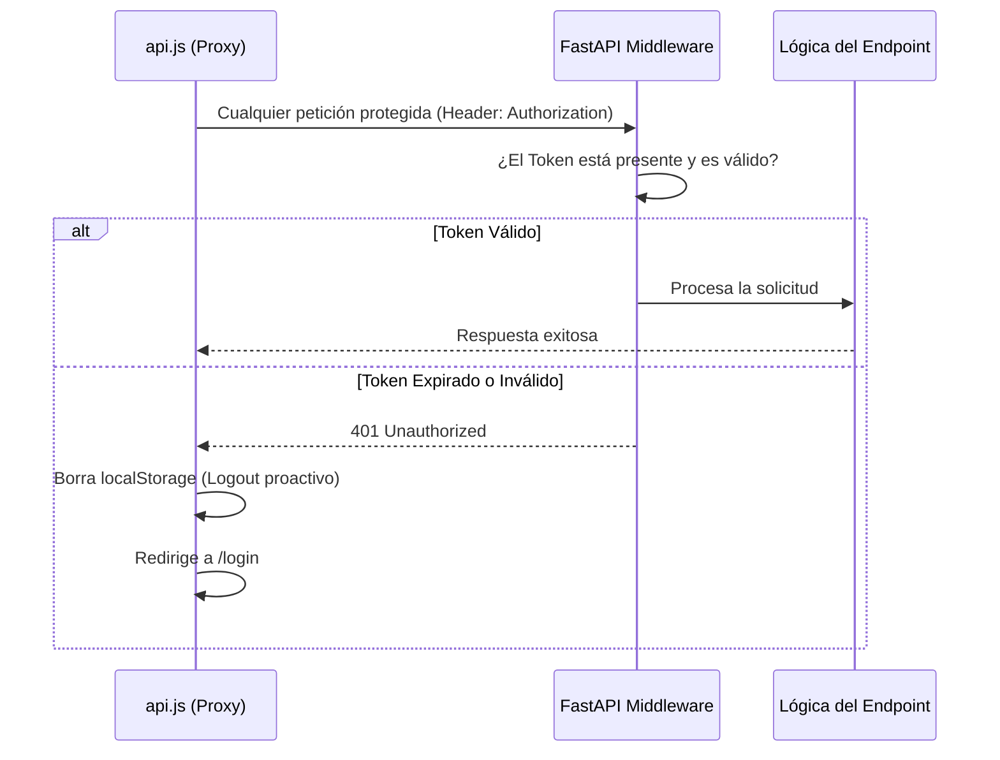

# Documentación Técnica y Arquitectura — MoneyFlow 💸

Este documento describe a detalle la arquitectura del software, los patrones de diseño aplicados, el esquema de la base de datos y la organización de los módulos del proyecto MoneyFlow.

---

## 1. Arquitectura General del Sistema

MoneyFlow está diseñado bajo el patrón **Cliente-Servidor** utilizando una arquitectura de **Single Page Application (SPA)** acoplada a una **API REST**.

---

## 2. Modelo de Datos (Diagrama Entidad-Relación)

La base de datos utiliza **SQLite** y es administrada a través del ORM SQLAlchemy. Se compone de 4 tablas fuertemente tipadas y relacionadas entre sí.

---

## 3. Desglose del Backend (Python / FastAPI)

El backend sigue una arquitectura limpia en capas para separar responsabilidades. Está construido con **FastAPI**.

### 3.1. Arquitectura de Capas
* **Capa de Enrutamiento (`routes/`):** Recibe las peticiones HTTP, valida los parámetros (usando esquemas de Pydantic) y delega el trabajo. No contiene lógica de negocio.
* **Capa de Servicios (`services/`):** Contiene la "Lógica de Negocio". Aquí se procesan reglas como (Hashear contraseñas, armar las estadísticas matemáticas para el dashboard, emitir JWTs).
* **Capa de Repositorios (`repositories/`):** Aísla la base de datos del resto de la aplicación. Aquí se ejecutan directamente las consultas ORM de SQLAlchemy.
* **Capa de Modelos y Esquemas (`models.py`, `schemas/`):** Definen las estructuras de las tablas SQL y los validadores de JSON entrantes/salientes respectivamente.

### 3.2. Módulos Principales
1. **Autenticación (`auth`):**
   * Emplea hashing `bcrypt` para las contraseñas.
   * Genera y valida tokens `JWT` (JSON Web Tokens) para mantener la sesión abierta de manera segura sin estado (stateless).
2. **Dashboard (`dashboard`):**
   * Agrega matemáticamente los datos del usuario para calcular saldo actual (ingresos − gastos).
   * Calcula métricas de **independencia financiera**: desglose de ingresos propios vs. apoyo familiar usando el campo `es_apoyo_familiar` de cada movimiento, retornando montos y porcentajes listos para graficar.
3. **Movimientos (`movimientos`):**
   * Núcleo del sistema. Implementa el CRUD (Crear, Leer, Eliminar) para el flujo de dinero, incluyendo el filtrado avanzado por fecha o categoría.
4. **Reportes (`reportes`):**
   * Realiza agrupaciones (GROUP BY) en base de datos para sumar el total gastado en cada categoría y alimentar los gráficos de Chart.js.
5. **Presupuestos (`presupuestos`):**
   * Permite al usuario definir límites de gasto mensuales por categoría (opcionalmente acotados a un mes y año específicos).
   * Calcula en tiempo real el gasto acumulado frente al límite y determina el estado: `ok` (< 75%), `advertencia` (≥ 75%) o `excedido` (≥ 100%).
   * Expone el endpoint `GET /presupuestos/alertas` usado por el dashboard para mostrar el banner de alertas automáticamente al iniciar sesión.

---

## 4. Desglose del Frontend (Vanilla JS)

Se omitió el uso de frameworks complejos en favor de un enfoque ligero basado en "Vanilla JS", logrando un diseño "Mobile First" hiper rápido y de bajo costo de mantenimiento.

### 4.1. Estructura de Control
* **`index.html`:** Contenedor maestro. Posee múltiples etiquetas `<section class="view">` que representan cada pantalla del sistema.
* **`app.js` (El Router):** Se encarga de cambiar entre vistas modificando la clase `.active`. Además, controla la "Barra de Navegación Global" (Navbar) en función de si el usuario está en una pantalla principal o en un formulario. Posee el motor global de Notificaciones (`showToast`).
* **`api.js` (El Proxy de Red):** Centraliza todas las peticiones `fetch` hacia el backend, inyectando automáticamente el `JWT Token` de seguridad en los "Headers" de cada petición. Si detecta un "401 Unauthorized", desconecta al usuario de forma proactiva.

### 4.2. Controladores de Dominio (`controllers/`)
Cada vista tiene un archivo JS que asocia los eventos (`addEventListener`) a la interfaz:
* `auth.js`: Recolecta el form, llama a `api.login()` o `api.register()` y guarda el token en `localStorage`.
* `dashboard.js`: Lee los resúmenes, pinta las tarjetas de balance e independencia financiera (barras de % apoyo familiar vs. ingresos propios) y carga el historial de movimientos.
* `movimientos.js`: Dinamiza el `select` de categorías basado en si seleccionaste un gasto o un ingreso.
* `categorias.js`: Lista visualmente las fuentes de ingreso y tipos de gastos.
* `presupuestos.js`: Gestiona el CRUD de presupuestos, renderiza las barras de progreso con estado de color (verde/amarillo/rojo) y actualiza el banner de alertas del dashboard.

---

## 5. Diagramas de Secuencia:

### 5.1 Flujo de Inicio de Sesión

A continuación se grafica el ciclo de vida completo del inicio de sesión, incluyendo la validación de credenciales y la emisión del JWT.

### 5.2 Flujo de Registro de un Usuario

A continuación se grafica el ciclo de vida completo del registro, incluyendo la validación de correo único y el hash de contraseña.

### 5.3 Flujo de Creación de un Gasto

A continuación se grafica el ciclo de vida completo de un evento común: el usuario registrando la compra de un "Uber".

### 5.4 Flujo de Visualización del Dashboard

### 5.5 Flujo de Visualización de Reportes

### 5.6 Flujo de Edición de un Movimiento

### 5.7 Flujo de Presupuestos y Alertas

### 5.8 Flujo de Autenticación con JWT

